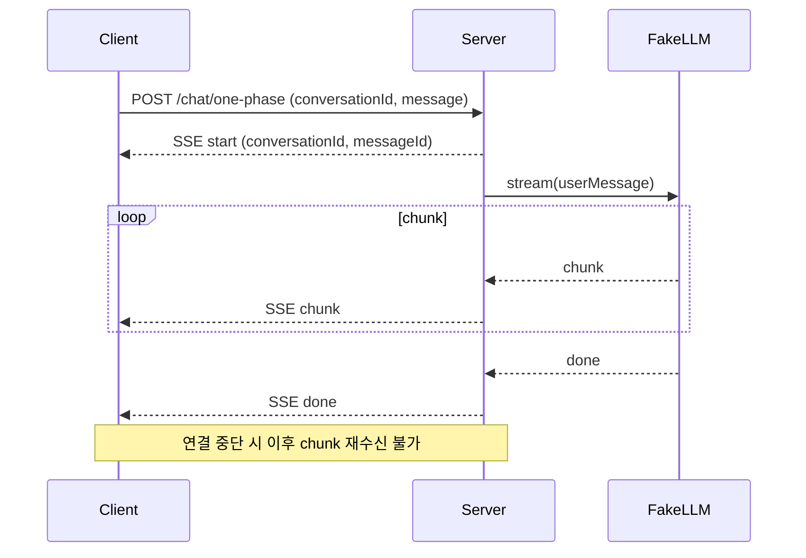
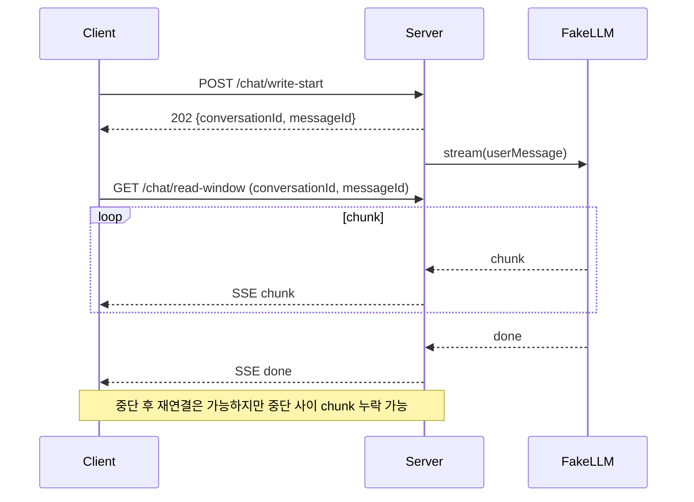
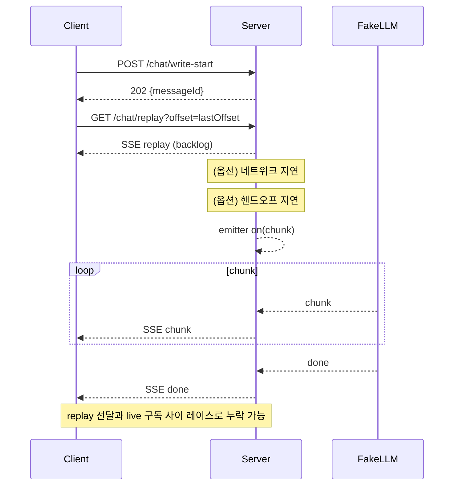
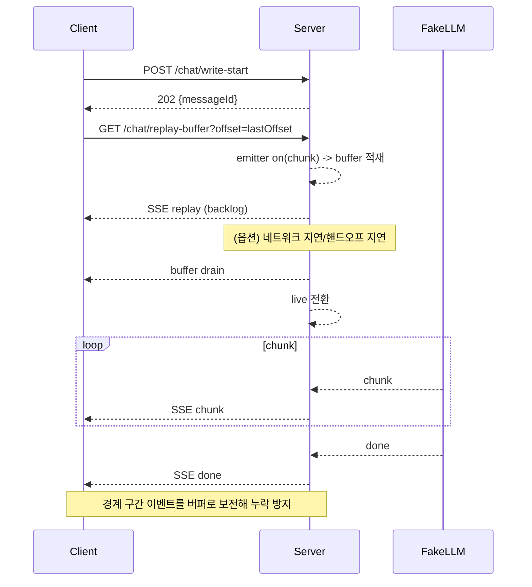

# 테스트 연구 결과 보고서 (TechSpec + 의사결정)

## 1. 연구 목적

본 연구는 LLM 스트리밍 전달 방식의 신뢰성(중단/재연결/지연 상황에서의 누락 여부)을 비교하고,
운영 환경에서 선택해야 할 패턴을 결정하기 위한 근거를 제공한다.

## 2. 테스트 사전 계획 (시나리오 제안 + 내부 동작)

오프셋(offset)은 SSE id로서 `conversationId:messageId:sequence` 형태의 단조 증가 식별자다.
각 시나리오는 오프셋 기준으로 재연결과 누락 가능성을 검증하는 데 목적이 있다.

### S1. POST + 스트리밍 (One-Phase)

목표: 가장 단순한 단일 연결 스트리밍에서 중단 시 복구 가능성을 확인한다.

### S2. POST(쓰기) + GET(읽기) (Two-Phase)

목표: 쓰기와 읽기를 분리해 재연결과 다중 reader를 가능하게 하되, 중단 구간 누락 여부를 확인한다.

### S3. 오프셋 리플레이 (Offset + Replay)

목표: 오프셋 기반 replay로 중간 합류 시 누락을 줄이고, replay/라이브 전환 시 누락 가능성을 확인한다.

### S4. 오프셋 + 버퍼 (Offset + Buffer)

목표: replay/live 경계 구간에서 발생하는 레이스를 버퍼로 제거할 수 있는지 확인한다.

## 3. 테스트 환경 (실행 전 정의)

비용과 통일성을 위해 FakeLLM을 사용하여 Lorem 텍스트를 고정 크기 chunk로 분할 전송한다.

| 항목 | 값 |
| --- | --- |
| 모델 | FakeLLM |
| 텍스트 유형 | Lorem |
| chunk 크기 | 12 chars |
| 기본 지연 | 100 ms |
| 지터 | 0~60 ms |
| 네트워크 지연 | 0 ms (가변) |
| 핸드오프 지연 | 0 ms (가변) |

## 4. 관측 결과 및 해석

손실량 해석 공통: 누락량은 중단 타이밍에 따른 휴리스틱 결과이므로 정량 자체의 중요도는 낮다.
핵심은 누락 발생 여부와 그 조건이다.

### S1. POST + 스트리밍 (One-Phase)

- 목표: 단일 연결 스트리밍에서 중단 복구 가능성을 확인한다.
- 의의: 구현이 가장 단순하며 실시간 전달 흐름이 명확하다.
- 한계: 중단 시 이후 데이터 재수신이 불가하다.
- 관측: 정상 완료 시 753자 전체 수신, 중단 시 이후 데이터 수신 불가.

### S2. POST(쓰기) + GET(읽기) (Two-Phase)

- 목표: S1의 중단 복구 불가를 해결하고 다중 reader 지원 여부를 확인한다.
- 의의: 읽기 재개와 다중 reader가 가능해 운영 유연성이 높다.
- 한계: 중단 구간에서 생성된 토큰이 누락될 수 있다.
- 관측: 다중 reader 및 읽기 재개는 가능하나, 중단 구간 누락으로 약 690자 손실이 관측됨.

### S3. 오프셋 리플레이 (Offset + Replay)

- 목표: S2의 중단 구간 누락을 줄이기 위해 오프셋 기반 replay를 적용한다.
- 의의: 중간 합류 시 과거 구간을 재전송해 안정성을 개선한다.
- 한계: replay 전송과 live 구독 사이 핸드오프 레이스로 누락이 발생할 수 있다.
- 관측: 네트워크/핸드오프 지연이 0이면 753자 수신, 지연 발생 시 약 730자 수신.

### S4. 오프셋 + 버퍼 (Offset + Buffer)

- 목표: S3의 replay/live 경계 레이스를 버퍼로 해소한다.
- 의의: 지연 조건에서도 누락을 방지해 신뢰성이 가장 높다.
- 한계: 버퍼 관리로 인해 구현 복잡도와 메모리 사용이 증가한다.
- 관측: 네트워크/핸드오프 지연이 0이거나 존재하더라도 753자 전체 수신.

## 5. 의사결정 요약

- 누락 방지 안정성이 최우선이면 S4가 유일하게 지연 조건에서도 완전 수신을 보장했다.
- 빠른 구현과 단순성이 우선이면 S1이 적합하지만, 중단 복구 불가를 전제로 해야 한다.
- S2는 재연결과 다중 reader가 필요할 때 유의미하나, 누락 허용 여부에 대한 정책이 필요하다.
- S3는 S2 대비 개선되지만 지연 환경에서 누락 가능성이 남아 운영 안정성 기준에는 미달한다.
